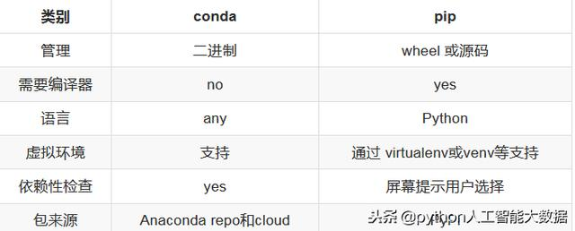

## pip和conda的关系


Conda和pip通常被认为几乎完全相同。虽然这两个工具的某些功能重叠，但它们设计用于不同的目的。 Pip是Python Packaging Authority推荐的用于从Python Package Index安装包的工具。 Pip安装打包为wheels或源代码分发的Python软件。后者可能要求系统安装兼容的编译器和库。

Conda是跨平台的包和环境管理器，可以安装和管理来自Anaconda repository以 Anaconda Cloud的conda包。 Conda包是二进制文件，徐需要使用编译器来安装它们。另外，conda包不仅限于Python软件。它们还可能包含C或C ++库，R包或任何其他软件。

这是conda和pip之间的关键区别。 Pip安装Python包，而conda安装包可能包含用任何语言编写的软件的包。在使用pip之前，必须通过系统包管理器或下载并运行安装程序来安装Python解释器。而Conda可以直接安装Python包以及Python解释器。

另一个区别是conda能够创建可以包含不同版本的Python或其他软件包的隔离环境。在使用数据科学工具时，这非常有用，因为不同的工具可能包含冲突的要求，这些要求可能会阻止它们全部安装到单个环境中。 Pip没有内置的环境支持，而是依赖于virtualenv或venv 等其他工具来创建隔离环境。 pipenv，poetry和hatch wrap pip和virtualenv等工具提供了统一的方法来处理这些环境。

Pip和conda在如何实现环境中的依赖关系方面也有所不同。安装包时，pip会在递归的串行循环中安装依赖项。没有努力确保同时满足所有包的依赖性。如果较早安装的软件包与稍后安装的软件包具有不兼容的依赖性版本，则可能导致破坏的环境。conda使用可确保满足环境中安装的所有包的所有要求。此检查可能需要额外的时间，但有助于防止创建破坏的环境，前期关于依赖关系包的元数据是正确的。

考虑到conda和pip之间的相似性，有些人试图将这些工具结合起来创建数据科学环境也就不足为奇了。将pip与conda结合的主要原因是有些包只能通过pip安装。 Anaconda创酷提供超过1,500个软件包，包括最流行的数据科学，机器学习和AI框架。这些，以及包括conda-forge和bioconda在内的数据通过Anaconda云提供的数千个附加软件包，可以使用conda进行安装。尽管有大量的软件包，但与PyPI上提供的150,000多个软件包相比，它仍然很小。有时候需要的包没有conda包，但在PyPI上有，可以用pip安装。




### pip与conda的包路径

1. conda install的package似乎是在anaconda\pkgs下，而pip install的package是在anaconda\Lib\site-packages下。推荐使用pip管理包（pip是python官方推荐的包管理器）

2. 如果你在base环境，pip install的package应该就是安装在anaconda\Lib\site-packages下，然后其他虚拟环境下的使用python packages时优先搜索该虚拟环境下的package，如果没有它就搜索base环境下的package，也就是base环境下的package是可以被其他虚拟环境使用的，如果你进入其他虚拟环境下使用pip install，那么下载的包就只在这个虚拟环境中


## pip

pip不支持升级所有安装过的python模块

列出当前安装的包：

```
pip list
```

列出可升级的包：

```
pip list --outdate
```

升级一个包：

```
pip install --upgrade requests
```

升级所有可升级的包：

```
pip freeze --local | grep -v '^-e' | cut -d = -f 1  | xargs -n1 pip install -U
```


## conda

获取版本号

```
conda --version
```


获取帮助

```
conda --help
conda -h
```


### conda env

查看虚拟环境

```
conda env list
conda info -e
```


创建环境

```
conda create --name env_name
source activate env_name
```


创建不同版本的python环境

```
conda create --name python27 python=2.7
conda create --name python34 python=3.4
```


### conda package管理

安装anaconda发行版中所有的包

```
conda install anaconda
```


在某环境中安装包

```
conda install -n env_name package_spec 
activate env_name && conda install package_spec
```


查看已经安装package情况

```
conda list	
conda list -n env_name
```


更新package

```
conda update package_spec
conda update anaconda
```

 查找包

```
conda search package_spec
```

 卸载包

```
conda remove package_spec
```


参考链接：

1. https://www.toutiao.com/i6632773927758201347/
2. https://blog.csdn.net/fyuanfena/article/details/52080270
3. https://blog.csdn.net/marsjhao/article/details/62884246
